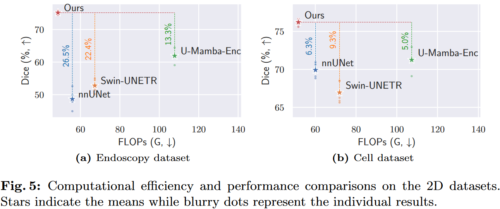

# <a href=https://arxiv.org/pdf/2408.14415>LoG-VMamba</a> 
LoG-VMamba: Local-Global Vision Mamba for Medical Image Segmentation

Arxiv: <a href=https://arxiv.org/abs/2408.14415>Link</a>




## Dependencies

We provide file `env.yaml` for dependencies.

## Installation

```bash
conda env create -f env.yaml
conda activate log_vmamba
pip install -e .
```

## Split data
```bash
cd mlpipeline/utils
python split_brats.py
```

## Training
```bash
python -m mlpipeline.train.run experiment=${EXP_NAME} \
        model.params.cfg.arch=${ARCH_NAME}
```
where
- <EXP_NAME>: experiment setting can be `brats_sem_seg`.
- <ARCH_NAME>: architecture name can be `UMambaEncDC_K1`.
